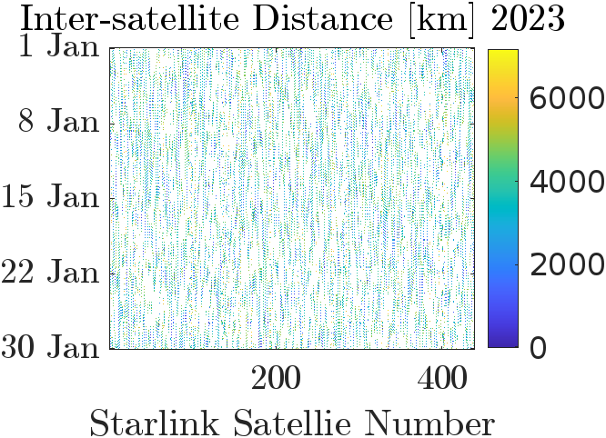
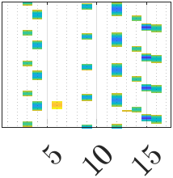

# Enviroment Setup
A virtual environment has bees used on the local machine (running Debian 12 bookworm) to establish the working. The requirements to setup the virtual enviroment can be installed using 'pip' and the 'requirements.txt' file.

The requirements.txt file has been obtained using
```bash
pip freeze > requirements.txt
```

These can be used to set-up the necessary virtual environment using
```bash
pip install -r requirements.txt
```

# Objective of the Project
## Propagate MATS Satellite in Orbit using TLEs
The MATS Satellite is propagated in time using the TLEs. The evolution of the satellite orbit over time is examined.

The elevation of the satellite as seen from teh Esrange Ground Station has also been plotted.

## Number of Starlink Satellites in Line-of-Site of MATS
For a fixed time-period, all the Starlink satellites and the MATS satellite is propagated and the number of satellites in Line-of-site of MATS are examined. The StarlinkData-2023 folder stores the data of a few starlink satellites for the year 2023. The files names in the folder correspond to the NORAD Catalog ID of the satellites.

The available data for some satellites is only upto the first 35 days of 2023. This, along with the number of satellites taken into consideration (439 satellites) is the reason for the analysis being limited to the first 30 days of January 2023.

### Dataset
The raw dataset were obtained from [Space-Track](https://www.space-track.org/) for Starlink Satellites and MATS from 2022-12-31 to 2023-02-01. These files are stored in the folder : datafiles/StartlinkData-2023. The MATS TLE files (54227.txt) is stored separately in the folder : datafiles

### Data Preprocessing
The raw dataset is converted into separate TLEs for each satellite using EachSatTLEfileGenerator.py. These separate TLE files are stored in the folder : StarlinkData-2023_raw.

The positions of the satellites from a 2023-01-01T00:00:00 to 2023-01-31T00:00:00 with time-step of 60 seconds has been calculated using TLE propagation. This history of position (NumpyArray) has been stored in *.txt files in the folder : SatellitePositions-NumpyArray. Position data is then loaded using the *.txt file for further analysis.

### Mathematical Formulation
The analysis has been simplified by assuming the Earth to be a sphere of constant radius equal to the WGS84_EARTH_EQUATORIAL_RADIUS. The mathematical formulation is based on the below presented diagram.

<p align="center">
  
  <div style="clear:both; margin-bottom:200px;"></div>
</p>

Thus, if $d > R_{earth}$, then the two satellites are in line-of-sight and hence can see each other.

For a more realistic formulation, a percentage padding can be added to compensate for elements which hinder visibility. The highest clouds (Noctilucent clouds) are at an altitude of 80km. Hence, with the WGS84_EARTH_EQUATORIAL_RADIUS = 6378137 m i.e $\approx$ 6378 km, the 80km padding corresponds to a 1.25\%  padding. Hence, let the adjusted radius of sphere $R_{adjusted}$ $\approx$ 6,460 km.

Thus, if $d >= R_{adjusted}$ (7970km), then the two satellites are in line-of-sight and hence can see each other.

$$
|d| = \sqrt{ |r_1|^2 - \frac{ (|d_{12}|^2 + |r_1|^2 - |r_2|^2)^2 }{4 |d_{12}|^2}}
$$

The MATS_Starlink_LineOfSight_Analysis.py file calculates this and stores a boolean numpy array in the LOS_visibility_data.txt file based on the visibility. This is then presented in MATS_Starlink_LineOfSight_Results.py.

### Results
The Line-Of-Sight results saved as boolean values illustrate the variation of satellite visibility over time for the MATS satellite. These results even illustrate how many satellites are visible at a given time. It must be noted that these results are obtained using threshold analysis for a pre-defined threshold, which is $R_{adjusted}$.
<p align="center">
  
  <div style="clear:both; margin-bottom:200px;"></div>
</p>

<p align="center">
  
  <div style="clear:both; margin-bottom:200px;"></div>
</p>

The results can even be used to analyse the extent of effect of the satellites owing to their distance. One of the crucial parameters is the minimum distance between a Starlink Satellite and MATS. The variation of the minimum inter-satellite distance between MATS and a Starlink Satellite is insightful.

<p align="center">
  
  
  <div style="clear:both; margin-bottom:200px;"></div>
</p>

The results are seen more prominently using a heatmap to illustrate the variation of intersatellite distances. They also illustrate the different visibility windows as well as the the relative radial velocities between the satellites.
<p align="center">
  
  <div style="clear:both; margin-bottom:200px;"></div>
</p>

<p align="center">
  
  <div style="clear:both; margin-bottom:200px;"></div>
</p>

An instance of the evolution of Line-of-Sight visibility can be seen below.
<p align="center">

</p>
